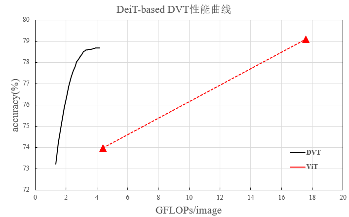

# Dynamic-Vision-Transformer-MindSpore

## Requirements

* Mindspore 1.0 (https://www.mindspore.cn/install/en)
* jinja2 (https://anaconda.org/anaconda/jinja2)
* tqdm (for GPU only)
* mpi4py (for GPU only)

## Training
You have to execute script from "src" directory. It will create directory "../results/{DATETIME}__{EXPERIMENT_NAME}" and place results there.

```
bash scripts/train_ascend.sh {0-7} EXPERIMENT_NAME --config=CONFIG_PATH --device {Ascend (default)|GPU} [TRAIN.PY_ARGUMENTS]

# training for feature reuse and releation reuse
bash scripts/train_ascend.sh 0-7 deit_dvt_12_49_196_w_f_w_r_adamw_originhead_dataaug_mixup --config=configs/local/vit_dvt/deit_dvt_12_49_196_w_f_w_r_adamw_originhead_dataaug_mixup.yml.j2

# training for feature reuse and w/o releation reuse
bash scripts/train_ascend.sh 0-7 deit_dvt_12_49_196_w_f_n_r_adamw_originhead_dataaug_mixup --config=configs/local/vit_dvt/deit_dvt_12_49_196_w_f_n_r_adamw_originhead_dataaug_mixup.yml.j2

# training for w/o feature reuse and releation reuse
bash scripts/train_ascend.sh 0-7 deit_dvt_12_49_196_n_f_w_r_adamw_originhead_dataaug_mixup --config=configs/local/vit_dvt/deit_dvt_12_49_196_n_f_w_r_adamw_originhead_dataaug_mixup.yml.j2

# training for w/o feature reuse and w/o releation reuse
bash scripts/train_ascend.sh 0-7 deit_dvt_12_49_196_n_f_n_r_adamw_originhead_dataaug_mixup --config=configs/local/vit_dvt/deit_dvt_12_49_196_n_f_n_r_adamw_originhead_dataaug_mixup.yml.j2

# inference for feature reuse and releation reuse
bash scripts/inference_ascend.sh 0 deit_dvt_12_49_196_w_f_w_r_adamw_originhead_dataaug_mixup_inference --config=configs/local/vit_dvt/deit_dvt_12_49_196_w_f_w_r_adamw_originhead_dataaug_mixup_inference.yml.j2

```

|model|flops|acc|
|-|-|-|
|deit-s/16|4.608|78.67|
|deit-s/32|1.145|72.116|
|vit-b/16|17.58|79.1|
|vit-b/32|4.41|73.972|

Top-1 accuracy on ImageNet v.s. GFLOPs




## Profiling (Ascend)
Just add parameter --profile to training script

